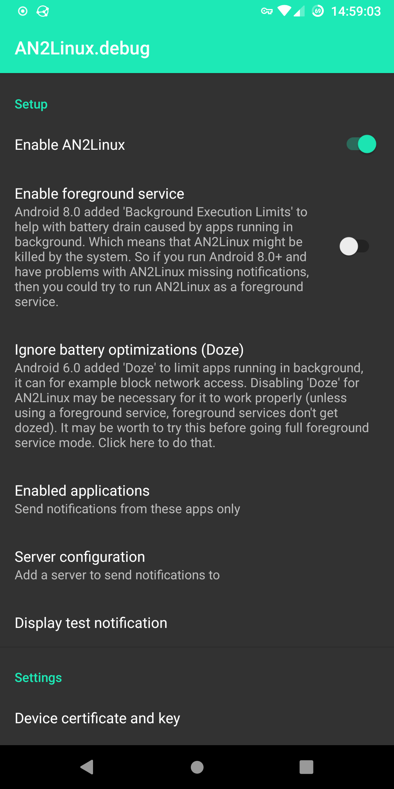
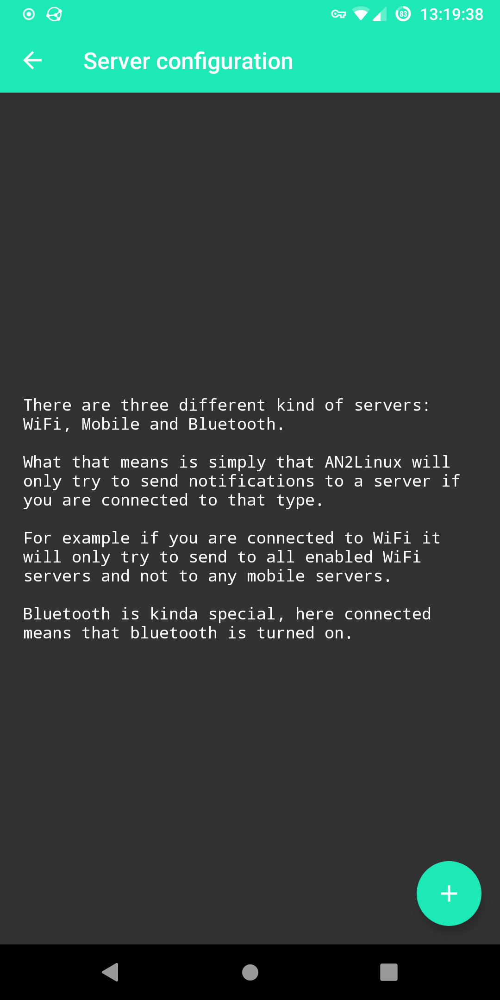
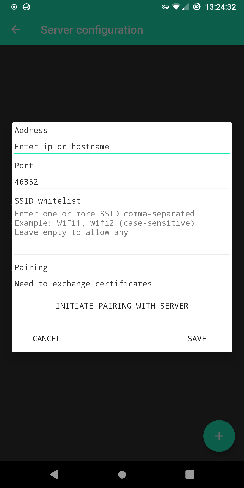
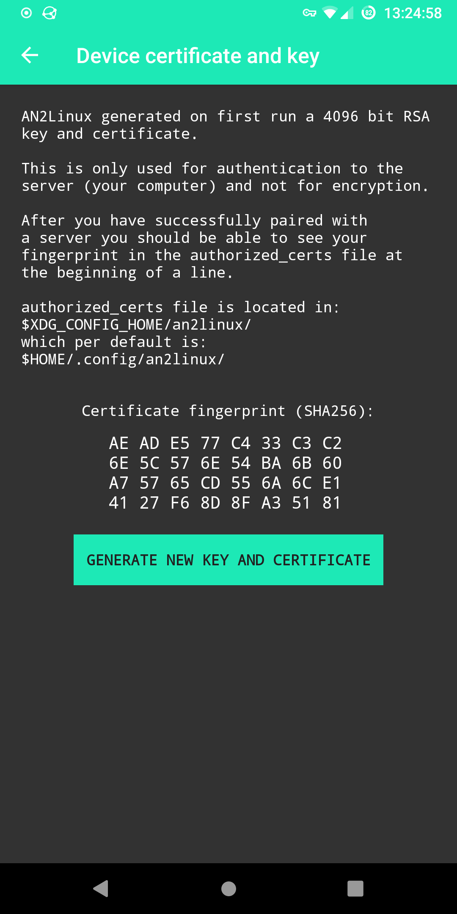
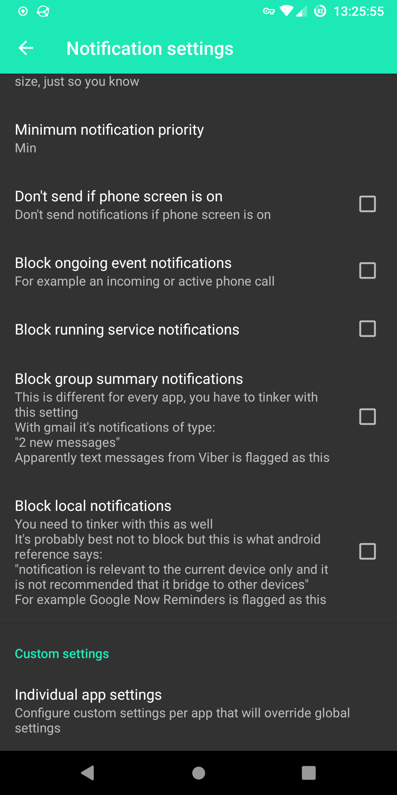
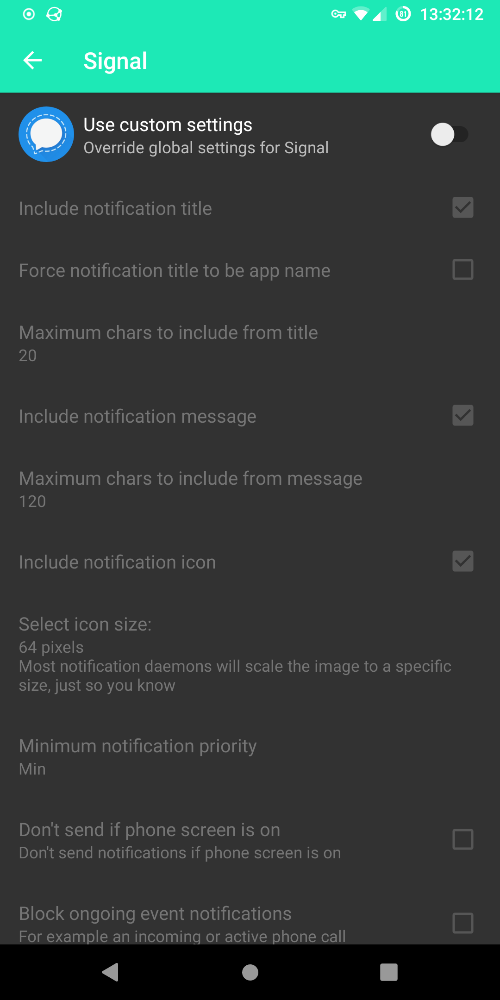

# AN2Linux - client (Android app)
Sync Android notifications encrypted using TLS to a Linux desktop over WiFi, Mobile data or Bluetooth.

## AN2Linux server
Setup instructions for AN2Linux server can be found here:
<a href="https://github.com/rootkiwi/an2linuxserver/" target="_blank">https://github.com/rootkiwi/an2linuxserver/</a>.

## Translation
Help with translation using Weblate.

## Screenshots
       

## License
[GNU General Public License 3](https://www.gnu.org/licenses/gpl-3.0.html).

See LICENSE for more details.
